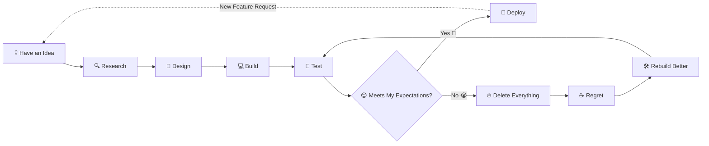

<!-- ====================================================== -->
<!--                       HERO SECTION                      -->
<!-- ====================================================== -->

<p align="center">


</p>

<p align="center">


</p>

<p align="center">


</p>

<p align="center">


</p>

---

# 👋 About Me

```ts
while (alive) {
  learn();
  build();
  breakSomething();
  fixIt();
  repeat();
}
```

I'm a university student who spends an unhealthy amount of time scrolling the internet looking for things worth building.

When I discover a real-world problem, my first instinct is usually:

> "Hmm... this sounds like a software engineering problem."

I primarily work as a **Full Stack Web Developer** using **Next.js + TypeScript**, while Python is my second home for automation, data processing, and occasionally AI experiments.

### Random Facts

- 🎓 Currently surviving university.
- 🧠 I enjoy finishing projects...
  **unless I suddenly decide the architecture is terrible and delete the entire codebase.**
- 🤖 I treat AI as a coworker.
- 🔍 I research competitors before building anything.
- 🚀 I enjoy trying:
  - Web Development
  - Mobile
  - AI / ML
  - Cyber Security
  - Robotics
- ☕ Sometimes the bug disappears after staring at it for 20 minutes.

---

# 🛠 Tech Stack

<p align="center">


</p>

<p align="center">


</p>

> **The technologies above represent tools I've used throughout coursework, personal projects, competitions, and experiments. While not all of them are part of my daily workflow, each has contributed to my learning journey and understanding of different engineering ecosystems.**

---

# ❤︎ Current Interests

| Technology | Interest Bar |
|------------|----------|
| Next.js | ██████████ |
| TypeScript | ██████████ |
| Python | ████████ |
| AI / ML | ███████ |
| Backend Architecture | ██████ |
| Automation | █████ |
| Robotics | ██ |

---

# 🚀 Featured Projects

```text
404 Featured repositories not found.
```

Most of my repositories are currently private because I'm still polishing them or they're simply not up to my own expectations.

> Yes...
>
> I'm my own harshest code reviewer.

---

# 🧠 Development Philosophy



---

# 🤖 AI

I don't use AI to avoid programming.

I use AI to:

- Brainstorm ideas
- Discuss software architecture
- Compare competitors
- Automate repetitive work
- Review my code
- Ask stupid questions at 2 AM

---

# ⚡ Fun Fact

There is approximately a **73%** chance that if you visit one of my repositories...

- it's unfinished.
- I'm rewriting it.
- or I suddenly had a better idea halfway through.

---

<p align="center">

> **Code is temporary. Curiosity is permanent.**

</p>

<p align="center">


</p>
